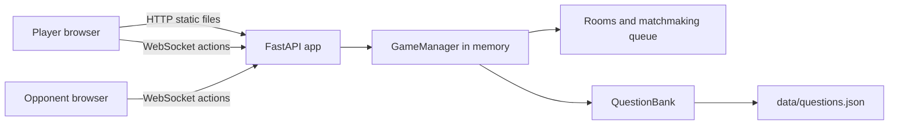
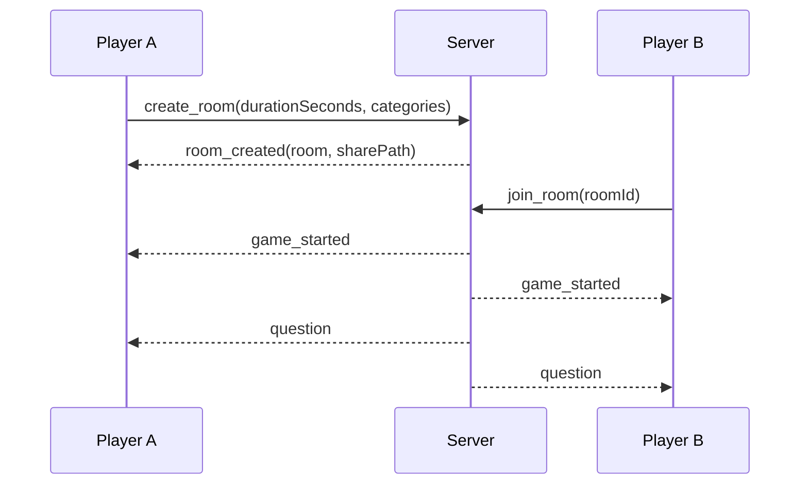
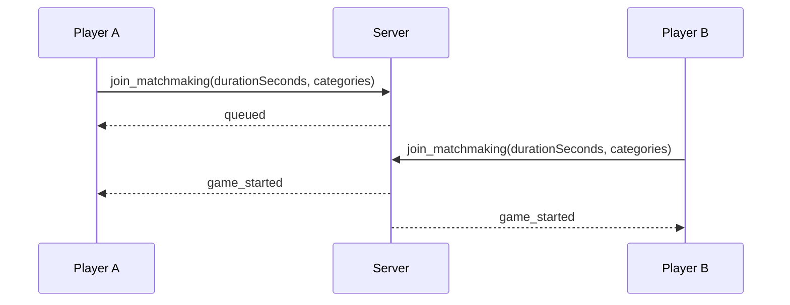
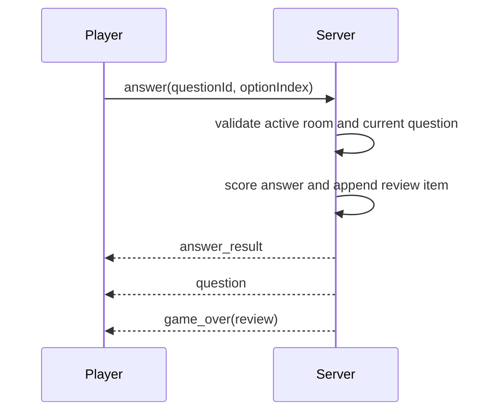

# Code Clash High-Level Design

## Goal

Code Clash is a profile-less timed MCQ battle app for placement and core CS prep. It supports solo play, share-link 1v1 rooms, and random matchmaking while keeping the first deploy free-hostable and simple to operate.

## Product Constraints

- No login, profile, ELO, permanent game history, or replay storage in the MVP.
- Invite links are valid only while the room waits for an opponent and expire after 30 minutes.
- Match duration is selected before the battle: 30 seconds, or 1 to 10 minutes.
- Battle type is selected before the battle: all topics, one topic, or any mix of topics.
- Scoring is simple: 1 point for each correct answer, no negative marks.
- Questions come from an updateable JSON bank with category and difficulty tags.
- Difficulty adapts during the game based on answered count, score, and streak.
- Answer review is available only for the current game and is not persisted.

## Architecture

## Runtime Components

- Browser client
  - Renders lobby, duration picker, waiting room, arena, result screen, and review screen.
  - Sends player actions over one WebSocket connection.
  - Keeps only transient UI state in memory.

- FastAPI server
  - Serves the static client.
  - Owns the WebSocket endpoint.
  - Provides health and admin question-reload endpoints.

- GameManager
  - Holds active WebSocket connections, rooms, and matchmaking queues in memory.
  - Creates rooms, pairs matchmaking players, enforces timers, scores answers, and expires rooms.
  - Sends per-player answer reviews at game over.

- QuestionBank
  - Loads and validates `data/questions.json`.
  - Picks questions by selected topic scope and target difficulty while avoiding repeats per player until the local pool is exhausted.

## Main User Flows

### Invite 1v1

### Matchmaking

Players are paired only when they select the same duration and topic scope. This avoids one player joining a 30-second DSA-only match while another expects a 10-minute all-topics match.

### Answer And Review

The review is sent only to the player who answered those questions. It is held in memory inside the active room and disappears when the room is cleaned up or the server restarts.

## Deployment Model

The current MVP is a single process:

- One FastAPI app serves both HTTP and WebSocket traffic.
- All active state lives in memory.
- This keeps the app free-hostable and simple for local demos.

Important scaling constraint: multiple server instances would split rooms and matchmaking queues. For production scale, move room coordination into a shared realtime coordinator such as Cloudflare Durable Objects, Redis, or another actor-style service.

## Data Storage

- Permanent data: `data/questions.json` in the repository.
- Runtime data: active connections, rooms, queue state, scores, and answer review arrays in memory.
- Not stored: profiles, completed games, ELO, personal history, or replay data.

## Future Architecture

1. Keep static assets on a CDN or the same app service.
2. Move room state into a durable room actor keyed by room code.
3. Add a small admin workflow for question uploads and validation.
4. Add anonymous identity, profiles, ELO, and history only after the base battle loop is stable.
